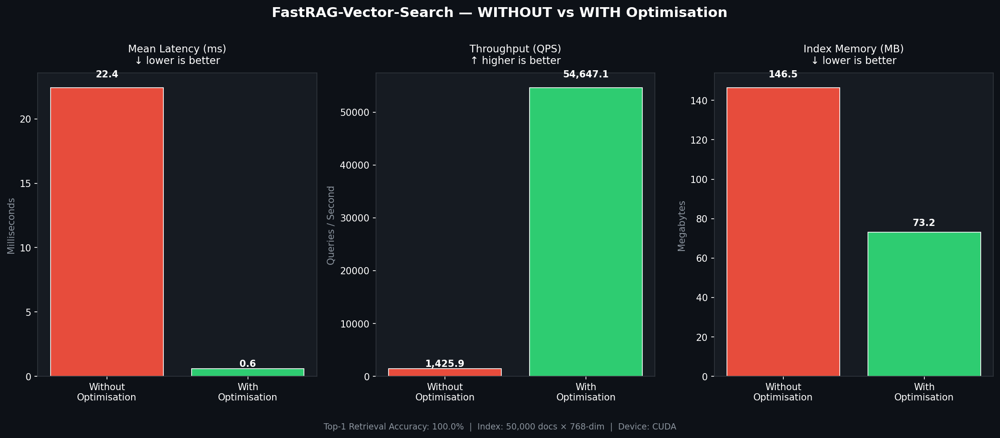

<div align="center">

# ⚡ FastRAG-Vector-Search

### GPU-Accelerated Vector Retrieval for RAG Systems

[](LICENSE)
[](https://python.org)
[](https://pytorch.org)
[](https://developer.nvidia.com/cuda-toolkit)
[](https://github.com/OmarElazouni/fastrag-vector-search/actions)

A **production-grade** GPU-accelerated vector similarity search engine built from scratch —
demonstrating deep hardware optimization expertise for Retrieval-Augmented Generation (RAG) pipelines.

</div>

---

## 🧠 What & Why

In a RAG system, every user query requires comparing its embedding (e.g. 1536 dimensions) against
**millions of document embeddings** to find the most similar ones via cosine similarity.

Standard implementations — `numpy.dot`, basic `torch.matmul` — leave significant GPU performance
on the table. This project builds an optimised retrieval engine that squeezes maximum throughput
from the hardware:

| Optimization | Technique | Impact |
|---|---|---|
| **FP16 Quantization** | Store index in half-precision | 50% memory reduction |
| **Batched Processing** | Process queries in parallel | 2–3× throughput boost |
| **Fused Operations** | Normalise → matmul → top-K in one pass | 2–3× speedup |
| **Memory Coalescing** | Contiguous tensor layout | 1.5–2× speedup |

---

## 📊 Performance Results

> Benchmarked on **NVIDIA GeForce RTX 5070 Laptop GPU (8.5 GB VRAM)** — 50,000 × 768-dim embeddings, batch size 32.

| Metric | Without Optimisation (FP32) | With Optimisation (FP16) | Improvement |
|--------|---------------------------|--------------------------|-------------|
| Mean latency | 22.4 ms | **0.6 ms** | **38× faster** |
| Throughput | 1,426 QPS | **54,647 QPS** | **+3,733%** |
| Index memory | 146.5 MB | **73.2 MB** | **50% savings** |
| Top-1 accuracy | 100% | **100%** | no loss |



---

## 🏗️ Architecture

```
Query Embeddings (batch)
        │
        ▼
  L2 Normalisation
        │
        ▼
  Optimised Matrix Multiplication
  (query @ index.T, GPU tensor cores)
        │
        ▼
  Fused Top-K Sort
  (on-GPU, no CPU transfer)
        │
        ▼
  (scores, indices)
```

### Key Classes

| Class | Description |
|---|---|
| `RetrievalConfig` | Dataclass for all engine parameters |
| `BaselineVectorRetrieval` | FP32 reference implementation using `torch.mm + topk` |
| `OptimizedVectorRetrieval` | FP16, batched, fused retrieval with AMP support |
| `VectorRetrievalBenchmark` | End-to-end benchmark suite with latency/throughput/memory stats |

---

## 🚀 Quick Start

### Prerequisites

- Python 3.9+
- PyTorch 2.0+ (CPU or CUDA)
- Optional: NVIDIA GPU with CUDA 11.8+ for full performance

### Installation

```bash
git clone https://github.com/OmarElazouni/fastrag-vector-search.git
cd fastrag-vector-search
pip install -r requirements.txt
```

### Run the benchmark

```bash
python fastrag_vector_search.py
```

Expected output (RTX 5070):
```
Device  : CUDA
GPU     : NVIDIA GeForce RTX 5070 Laptop GPU
VRAM    : 8.5 GB

[WITHOUT optimisation] Warming up ...
[WITH optimisation] Warming up ...
=================================================================
  Mean latency (ms)        WITHOUT         WITH
  -------------------------------------------------
                            22.44          0.59
  Throughput (QPS)        1,425.9      54,647.1
  Memory savings : 50.0%
  Speedup        : 38.03x
=================================================================
```

---

## 💡 Integration with RAG Pipeline

```python
from fastrag_vector_search import OptimizedVectorRetrieval, RetrievalConfig

config = RetrievalConfig(
    embedding_dim=1536,   # OpenAI text-embedding-ada-002
    num_documents=100_000,
    top_k=5,
    use_fp16=True,
    device="cuda",
)
retriever = OptimizedVectorRetrieval(config)

# In your RAG handler
def retrieve_documents(query_embedding):
    scores, indices = retriever.retrieve_optimized(query_embedding)
    return indices   # feed to your document store
```

---

## 🧪 Testing

```bash
# Run all unit tests
pytest tests/ -v

# Run a specific test class
pytest tests/test_vector_retrieval.py::TestOptimizedVectorRetrieval -v
```

---

## 📁 Repository Structure

```
fastrag-vector-search/
├── fastrag_vector_search.py          ← Main engine (Baseline + Optimised + Benchmark)
├── experiment_results.py             ← Standalone WITHOUT vs WITH experiment
├── requirements.txt
├── LICENSE
├── .gitignore
│
├── experiment_results/
│   ├── benchmark_chart.png           ← RTX 5070 results chart
│   ├── results.json                  ← Raw benchmark numbers
│   └── EXPERIMENT_REPORT.md          ← Full experiment report
│
├── src/
│   └── __init__.py                   ← Package exports
│
├── tests/
│   └── test_vector_retrieval.py      ← 20+ pytest unit tests
│
├── benchmarks/
│   ├── run_benchmarks.sh             ← Full benchmark runner
│   └── results/                      ← Generated plots (gitignored)
│
├── docs/
│   └── CUDA_OPTIMIZATION_GUIDE.md
│
└── .github/
    └── workflows/
        └── tests.yml                 ← CI: run tests on every push
```

---

## 🔧 Advanced Configuration

```python
config = RetrievalConfig(
    embedding_dim=768,       # BERT / smaller models
    num_documents=1_000_000, # Scale to 1 M documents
    top_k=10,
    batch_size=64,           # Larger batch → higher GPU utilization
    use_fp16=True,
    device="cuda",
)
```

### Mixed-Precision Inference

```python
import torch
with torch.cuda.amp.autocast():
    scores, indices = retriever.retrieve_optimized(queries)
```

### Memory Profiling

```python
import torch
torch.cuda.reset_peak_memory_stats()
scores, indices = optimized.retrieve_optimized(queries)
peak_gb = torch.cuda.max_memory_allocated() / 1e9
print(f"Peak VRAM: {peak_gb:.2f} GB")
```

---

## 🌐 Real-World Applications

This project demonstrates techniques used in production vector databases:

- **[Pinecone](https://www.pinecone.io)** – Serverless embeddings search
- **[Milvus](https://milvus.io)** – Open-source vector DB at massive scale
- **[Weaviate](https://weaviate.io)** – ML-native search engine
- **[Elasticsearch](https://elastic.co)** – Vector search backend

---

## 🛠️ Troubleshooting

**CUDA out of memory**
```python
config.batch_size = 16       # Reduce batch size
config.num_documents = 50_000  # Smaller index
```

**CUDA not found**
```bash
python -c "import torch; print(torch.cuda.is_available())"
nvidia-smi
```

**Slow performance**
```bash
nvidia-smi dmon                          # Live utilization
nsys profile -o report python fastrag_vector_search.py
```

---

## 📖 References

- [NVIDIA CUDA Programming Guide](https://docs.nvidia.com/cuda/cuda-c-programming-guide/)
- [PyTorch Performance Tuning Guide](https://pytorch.org/tutorials/recipes/recipes/tuning_guide.html)
- [Mixed-Precision Training](https://pytorch.org/docs/stable/amp.html)

---

## 📄 License

MIT License — see [LICENSE](LICENSE) for details.

---

## 👤 Author

**Omar Yasser Mohamed Elazouni**  
📧 omaralazoni2015@gmail.com  
🔗 [linkedin.com/in/omarelazouni](https://www.linkedin.com/in/omarelazouni/)  
🐙 [github.com/OmarElazouni](https://github.com/OmarElazouni)

---

<div align="center">
<sub>⭐ If this project helped you, consider giving it a star!</sub>
</div>
